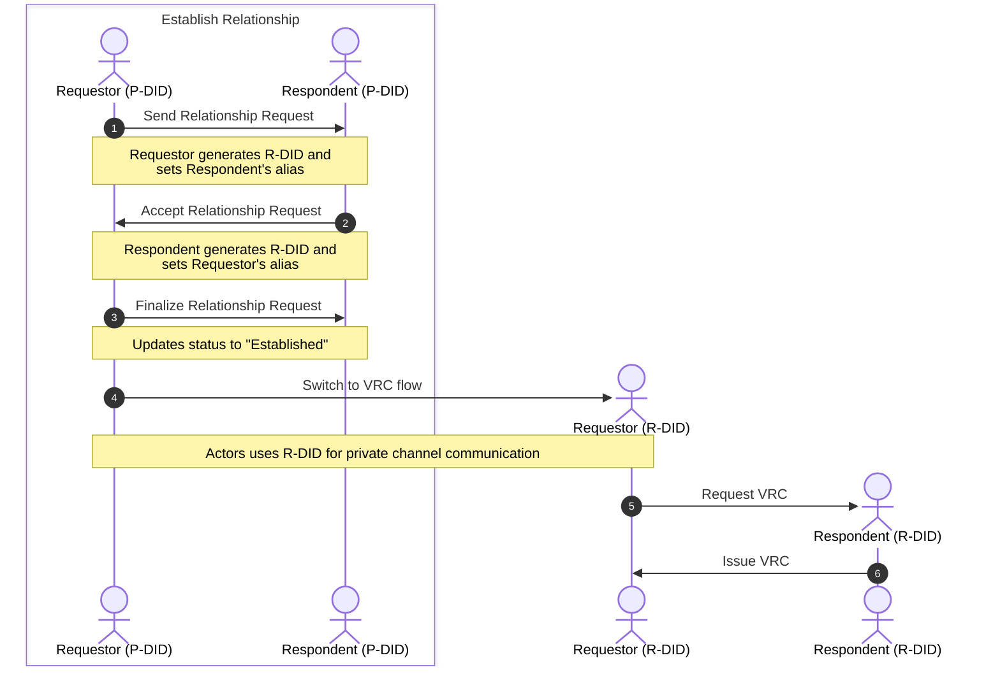

# Relationships and VRCs

> **Note:** The command examples in this guide predate the TUI and are being
> rewritten. The `openvtc relationships` and `openvtc vrcs` subcommands no
> longer exist — relationships are managed from the Relationships panel and the
> Inbox in the TUI. The flow and the concepts below are still accurate; only the
> invocations are stale.

The OpenVTC tool enables you to establish relationships with other DIDs (e.g., peers, coworkers, or community members) and communicate privately through the DIDComm protocol.

Each relationship gets its own **Relationship DID (R-DID)** by default — a pairwise identifier used only with that one contact. You can choose to use your **Persona DID (P-DID)** instead; see [Choosing your identifier](#choosing-your-identifier) for what that costs.

Once a relationship is established, you can request a **Verifiable Relationship Credential (VRC)**, a peer-to-peer credential that attests to verifiable trust relationships between personhood credential holders.

_The diagram below illustrates the typical flow of establishing a relationship and requesting a VRC. An R-DID is generated to enable private channel communication between parties._



## Table of Contents

- [Choosing your identifier](#choosing-your-identifier)
- [Establish Relationship](#establish-relationship)
  - [1. Send Relationship Request (Requestor)](#1-send-relationship-request-requestor)
  - [2. Accept Relationship Request (Respondent)](#2-accept-relationship-request-respondent)
  - [3. Finalise Relationship Request](#3-finalise-relationship-request)
- [Request Verifiable Relationship Credential (VRC)](#request-verifiable-relationship-credential-vrc)
  - [Prerequisite](#prerequisite)
  - [1. Request VRC Issuance (Requestor)](#1-request-vrc-issuance-requestor)
  - [2. Generate and Issue VRC (Respondent)](#2-generate-and-issue-vrc-respondent)
  - [3. Claim and Store VRC (Requestor)](#3-claim-and-store-vrc-requestor)
- [List and View VRCs](#list-and-view-vrcs)

## Choosing your identifier

Every relationship is established under one of two identifiers, chosen when you
send the request or accept an incoming one. The default is the pairwise R-DID.

| | **Pairwise R-DID** (default) | **Your persona DID** |
| --- | --- | --- |
| What the contact sees | A fresh `did:peer` used only with them | Your published `did:webvh` |
| Linkable to your other relationships | No — each contact sees a different identifier | Yes — every contact sees the same string |
| Resolvable by anyone | No | Yes, and it often carries your verified agent name |
| Recognisable as you | No, unless you tell them | Yes, immediately |

The cost of reusing the persona DID is that correlation stops being an inference
and becomes a lookup: two contacts who compare notes see the same identifier and
can resolve it to a named identity. That is why pairwise is the default.

The reason to choose the persona DID anyway is recognition — a contact who
already knows your published DID or agent name can verify it is really you
without a separate introduction.

Once a relationship holds an R-DID, subsequent messages always use it. There is
no fallback to the persona DID mid-relationship.

**Note:** The three handshake messages (request, accept, finalise) are routed
between persona DIDs regardless of this choice, because the mediator has to
route them before a pairwise channel exists. The R-DID takes over once the
relationship is established, and the VRC is issued under it — so the durable
credential, which is the artifact that would otherwise correlate you across
every relationship you hold, names only the pairwise identifier.

The handshake DIDs are observed once, by the mediator, at establishment. The
credential lasts as long as either party keeps it. That asymmetry is why the
issuer field mattered more than the routing does.

## Establish Relationship

Follow these steps to establish a relationship with another Persona DID.

### 1. Send Relationship Request (Requestor)

In the Relationships panel, start a new request and fill in:

| Field | Description |
| --- | --- |
| DID | The respondent's persona DID, or an agent name such as `example.com/@bob` |
| Alias | A local name for this relationship |
| Reason | Why you are asking |
| Contact you as | `Pairwise R-DID` (default) or `Your persona DID` — press Space to change |

The last field is the choice described in [Choosing your identifier](#choosing-your-identifier).
It defaults to minting a fresh R-DID for this contact.

**Note:** Initiating a relationship request automatically adds the respondent to your Contacts list.

Refer to the sample response below:

```bash
Generated new Relationship DID for contact FrancisP2 :: did:peer:2.Vz6Mkkop...

✅ Successfully sent Relationship Request to did:webvh:QmQzm...
```

For more details, see the [CLI documentation](./openvtc-tool-commands.md#openvtc-relationships).

### 2. Accept Relationship Request (Respondent)

1. Fetch and process incoming requests:

   ```bash
   openvtc tasks interact
   ```

   The tool fetches messages from the mediator. If you have a relationship request, you'll see a task with type **`Relationship Request`**.

   Open the task to see the request detail.

2. Accept it with either identifier:

   - `a` — accept with a pairwise R-DID (the default, private path)
   - `p` — accept as your persona DID

   See [Choosing your identifier](#choosing-your-identifier) for the trade-off.
   The detail view states both outcomes at the point of choice.

3. Enter an alias for the requestor to easily identify this relationship.

After entering the alias, the tool updates the relationship status to **`Request Accepted`** and notifies the requestor.

Refer to the sample response below:

```bash
✅ Successfully sent Relationship Request Acceptance to did:webvh:Qmbea...
```

### 3. Finalise Relationship Request

Both parties must complete finalisation:

#### 1. Requestor

Run `openvtc tasks interact` to fetch the acceptance message. This updates the relationship status from **`Request Sent`** to **`Established`** and sends a finalisation message to the respondent.

Refer to the sample response below:

```bash
✅ Successfully sent Relationship Request Finalize to did:webvh:QmQzm...
Task Id: 020bb98e-5460-4d42-b369-bf4a65b4909c Type: Relationship request accepted
```

#### 2. Respondent

Run `openvtc tasks interact` to fetch the finalisation message. This updates the relationship status from **`Request Accepted`** to **`Established`**.

Once both parties have **`Established`** status, you can communicate and request VRCs.

Refer to the sample response below:

```bash
✅ Relationship successfully established did:webvh:Qmbea...
  Remote: P-DID(did:webvh:Qmbea...) r-did(did:peer:2.Vz6Mkkop...)
  Local: P-DID(did:webvh:QmQzm...) r-did(did:peer:2.Vz6Mkgt...)
Task Id: 020bb98e-5460-4d42-b369-bf4a65b4909c Type: Relationship request finalized
```

## Request Verifiable Relationship Credential (VRC)

A VRC is a peer-to-peer credential attesting to a verifiable trust relationship
between two parties (coworkers, peers, community members). It names each side by
the identifier that side uses in *this* relationship — the pairwise R-DID by
default, or the persona DID if that was chosen when the relationship was
established.

### Prerequisite

You must establish a relationship before requesting a VRC. To request for relationship, refer to the [Establish Relationship](#establish-relationship) section.

### 1. Request VRC Issuance (Requestor)

Request a VRC from an established relationship:

```bash
openvtc vrcs request
```

1. Select the relationship from which you want to request a VRC.

2. Fill in the following fields when prompted:

   > **Important:** All values are suggestions. The issuer may modify them when generating the VRC.

   | Field  | Description                           |
   | ------ | ------------------------------------- |
   | Reason | Explain why you are requesting a VRC. |

3. Review and submit the request. Refer to the sample response below:

   ```bash
   ✅ Successfully sent VRC Request. Remote DID: did:peer:2.Vz6Mkg...
   ```

### 2. Generate and Issue VRC (Respondent)

1. Fetch and process VRC requests:

   ```bash
   openvtc tasks interact
   ```

   You'll see tasks with type `VRC Request`. Select the task and click **Accept this VRC request**.

2. Fill in the following fields:

   | Field                 | Description                                                                            |
   | --------------------- | -------------------------------------------------------------------------------------- |
   | Valid From Date       | VRC valid from date of relationship establishment, current date/time, custom date/time |
   | Valid Until Timestamp | VRC valid until a specified date or select **no** if it won't expire                   |

The tool generates and issues the VRC to the requestor, storing a record in your private configuration.

Refer to the sample VRC below:

```bash
Issued VRC
{
  "@context": [
    "https://www.w3.org/ns/credentials/v2",
    "https://firstperson.network/credentials/relationship/v1"
  ],
  "type": [
    "VerifiableCredential",
    "DTGCredential",
    "RelationshipCredential"
  ],
  "issuer": "did:peer:2.Vz6Mkgt...",
  "validFrom": "2025-12-02T08:58:43Z",
  "validUntil": "2026-12-02T00:00:00Z",
  "credentialSubject": {
    "id": "did:peer:2.Vz6Mksm..."
  },
  "proof": {
    "type": "DataIntegrityProof",
    "cryptosuite": "eddsa-jcs-2022",
    "created": "2025-12-02T08:58:43Z",
    "verificationMethod": "did:webvh:QmQzm...#key-1",
    "proofPurpose": "assertionMethod",
    "proofValue": "zAXERK8RVBH..."
  }
}
```

For more details, see the [draft specification](https://github.com/trustoverip/dtgwg-cred-tf/blob/14-revised-vrc-spec---v02/dtg.md#core-structure) of the VRC.

### 3. Claim and Store VRC (Requestor)

After the VRC is issued, claim it:

```bash
openvtc tasks interact
```

Select the task with type **`VRC Issued`**. Review the credential details and select **Accept this VRC** to store it locally.

## List and View VRCs

**List all VRCs:**

```bash
openvtc vrcs list
```

This displays all VRCs (issued or claimed) stored locally.

**View a specific VRC:**

```bash
openvtc vrcs show <VRC_ID>
```

This displays the credential details on the screen.

For more details, see the [CLI documentation](openvtc-tool-commands.md#openvtc-vrcs).
